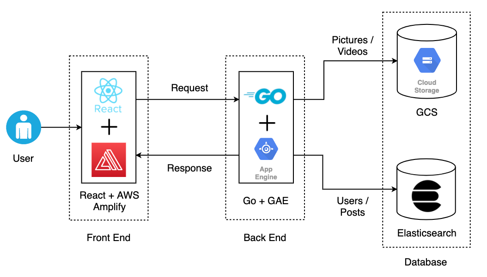

# Circle

### Overview
Circle is a full-stack web application for people to share photos/videos and publish posts.

### Project Architecture

### Tools and Technologies

* <strong>Front-end: </strong>React
* Built user-friendly webpages for users to create and browse posts and search other users' posts using *React*

* <strong>Authentication: </strong>Token-based authentication
* <strong>Deployment: </strong>AWS Amplify

* <strong>Back-end: </strong>Go
* Launched a scalable web service in *Go* to handle user posts and account information
* Used *Elasticsearch* to support searching posts based on keyword or username
* <strong>Deployment: </strong>Google Cloud Engine

### Main Features
* Supports basic login/logout function flow with React Router v4 and server-side user authentication with JWT
* User-friendly webpages for users to create and browse posts and search other users' posts
* 
